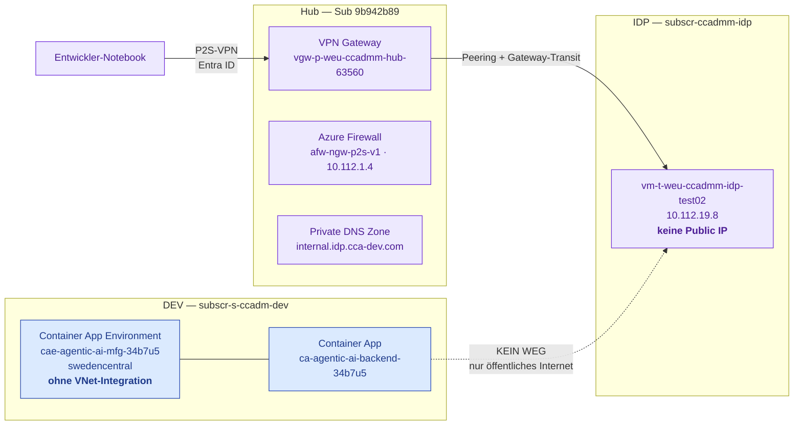
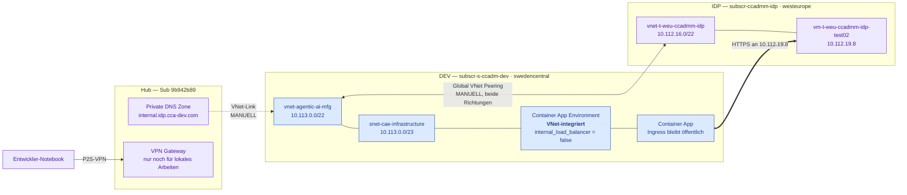
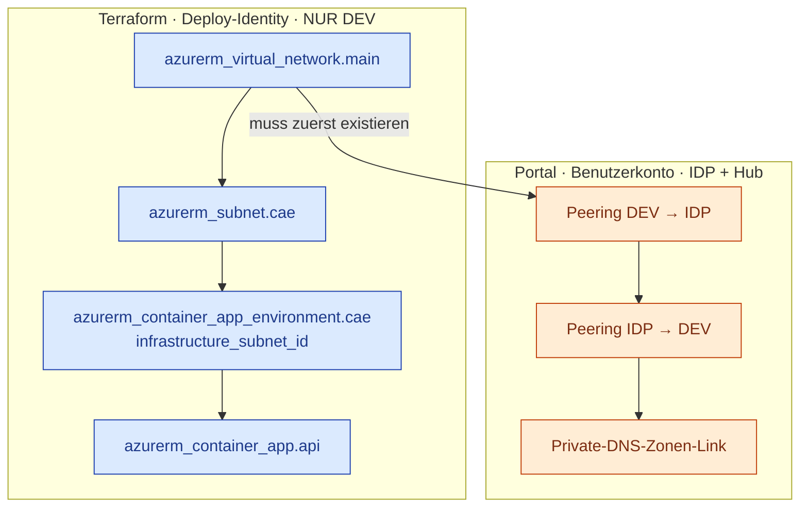

# Netzwerkarchitektur — Anbindung der Container App an Smart Planning

> **Dokumenttyp:** zitierfähige Infrastruktur- und Netzwerkdokumentation
> **Stand:** 04.08.2026
> **Geltungsbereich:** Netzwerkpfad zwischen der Azure Container App (DEV) und der
> Smart-Planning-Instanz (ESAROM) auf `vm-t-weu-ccadmm-idp-test02`.
> **Abgrenzung:** Anwendungsarchitektur siehe [ARCHITEKTURDIAGRAMME_PROJEKTBERICHT.md](ARCHITEKTURDIAGRAMME_PROJEKTBERICHT.md).
> Die Klickanleitung für die manuellen Schritte steht im Infrastruktur-Repository
> unter `docs/NETWORK_SETUP.md`.

---

## 1. Leselogik — bitte zuerst lesen

Dieses Dokument beschreibt zwei Zustände, die **nicht** verwechselt werden dürfen.

| Kennzeichnung | Bedeutung |
|---|---|
| **IST** | Heute in Azure vorhanden und per Abfrage nachgewiesen (Abschnitt 9). |
| **SOLL** | Als Terraform-Code geschrieben und geplant, aber **noch nicht ausgerollt**. |

> **Zum Stand 04.08.2026 ist der Netzwerkpfad NICHT hergestellt.**
> Der Terraform-Code liegt vor und `terraform plan` läuft erfolgreich durch, aber es
> wurde **kein `apply`** ausgeführt. Die Container App kann Smart Planning derzeit
> nicht erreichen. Wer dieses Dokument für einen Bericht verwendet, muss den
> SOLL-Teil als geplant kennzeichnen.

Farbkonvention (kompatibel zur bestehenden Architekturdokumentation):

- **Blau:** eigenes System / eigene Terraform-Ressourcen
- **Violett:** fremde Infrastruktur außerhalb der eigenen Subscription
- **Grün:** Datenhaltung
- **Orange:** manuell und bewusst außerhalb der Automatisierung
- **Grau gestrichelt:** noch nicht ausgerollt

---

## 2. Das Problem in einem Satz

Die Smart-Planning-VM hat **keine öffentliche IP**, liegt in einer fremden
Subscription und trägt einen **privaten DNS-Namen** — die Container App läuft
dagegen ohne VNet-Anbindung und kennt nur das öffentliche Internet.

Es sind daher **zwei** Probleme, nicht eines:

1. **Routing** — es existiert kein Netzwerkpfad in ein privates Netz.
2. **Namensauflösung** — `*.internal.idp.cca-dev.com` ist eine private DNS-Zone.

Eine Lösung, die nur eines von beiden adressiert, führt zu einem der beiden
typischen Fehlerbilder: Namensauflösung schlägt fehl (DNS fehlt) oder die
Verbindung läuft in einen Timeout (Routing fehlt).

---

## 3. Beteiligte Subscriptions

| Rolle | Name | ID | Rechtelage |
|---|---|---|---|
| DEV — eigene Anwendung | `subscr-s-ccadm-dev` | `17b4807c-05a1-4c15-b35e-1a6b20bc37b3` | Terraform / Deploy-Identity |
| IDP — Smart-Planning-VM | `subscr-ccadmm-idp` | `40e08bde-e349-4ac5-8299-6c6e2f5c33f6` | Benutzerkonto, volle Rechte |
| Hub — Netz und DNS | *(Connectivity)* | `9b942b89-e1d1-454e-a11c-18531063ef2d` | Benutzerkonto, volle Rechte |

**Grundsatz für die DEV-Umgebung:** Es wird ausschließlich verwendet, was das eigene
Terraform mitbringt. Bestehende Ressourcen in DEV — insbesondere das bereits
vorhandene `vnet-dev-soi` samt dessen Hub-Peering — werden **nicht** genutzt.

---

## 4. IST — Zustand vor der Umstellung



**Warum der lokale Zugriff funktioniert, der aus der Cloud aber nicht:** Das
Notebook meldet sich per Point-to-Site am Hub-Gateway an. Das IDP-Spoke hat
`useRemoteGateways = true` und bekommt die Gateway-Routen propagiert — der
VPN-Client erreicht die VM also über den Hub. Die Container App ist an diesem
Netz jedoch überhaupt nicht beteiligt.

---

## 5. SOLL — Zustand nach dem Rollout



**Der Hub ist am Datenpfad nicht mehr beteiligt.** Das Peering geht direkt von
Spoke zu Spoke. Der Hub bedient nur noch das lokale VPN und hält die DNS-Zone.

---

## 6. Adressplan

| Netz | Bereich | Region | Herkunft |
|---|---|---|---|
| `vnet-p-weu-ccadmm-hub` | `10.112.0.0/23` | westeurope | IST |
| `vnet-t-weu-ccadmm-idp` | `10.112.16.0/22` | westeurope | IST |
| *(winvm-demo)* | `10.112.32.0/29` | — | IST |
| `vnet-dev-soi` | `10.100.200.0/22` | — | IST, **nicht genutzt** |
| *(LLM-Spokes)* | `10.127.224.0/22`, `10.127.228.0/24` | — | IST |
| *(Workstation-Spokes)* | `10.128.0.0/22` … `10.128.12.0/22` | — | IST |
| **`vnet-agentic-ai-mfg`** | **`10.113.0.0/22`** | swedencentral | **SOLL** |
| ↳ `snet-cae-infrastructure` | `10.113.0.0/23` | swedencentral | SOLL |

`10.113.0.0/22` ist gegen alle am Hub sichtbaren Peerings kollisionsfrei.

> **Einschränkung dieser Prüfung:** Sichtbar sind nur die an
> `vnet-p-weu-ccadmm-hub` gepeerten Bereiche. Netze, die anderswo in der
> Organisation existieren, sind hier nicht erfasst. Der Bereich ist vor dem
> ersten `apply` gegen das IPAM zu bestätigen.

**Subnetzgröße /23:** Eine Consumption-only Environment verlangt mindestens /23
ohne Delegation; Workload-Profile-Environments kämen mit /27 aus, benötigen aber
die Delegation `Microsoft.App/environments`. Der /23-Zuschnitt erfüllt beide
Anforderungen, sodass ein späterer Wechsel keinen Neuzuschnitt erzwingt.

---

## 7. Verantwortungsteilung — automatisiert gegen manuell



### Warum drei Schritte bewusst manuell bleiben

Azure verlangt zum Anlegen eines Peerings die Berechtigung
`Microsoft.Network/virtualNetworks/peer/action` auf dem **Ziel**-VNet. Auch die
DEV-seitige Hälfte bräuchte damit eine Rolle in der IDP-Subscription.

**Entscheidung (04.08.2026):** Die Deploy-Identity erhält **keine einzige
Berechtigung außerhalb von DEV**. Peering und DNS-Link werden manuell mit dem
Benutzerkonto angelegt. Eine CI-Identity mit Schreibrecht in einer fremden
Subscription ist ein Angriffsziel, das der Nutzen nicht rechtfertigt.

**Zur Laufzeit berührt die Managed Identity die IDP-Subscription ohnehin nie:**
ACR, Key Vault und Azure OpenAI liegen in DEV; die Anmeldung an ESAROM läuft über
Keycloak mit `SMART_PLANNING_CLIENT_SECRET`, nicht über Entra ID. Netzwerkverkehr
selbst benötigt keine Azure-Berechtigung.

---

## 8. Architekturentscheidungen

### E1 — Direktes Spoke-zu-Spoke-Peering statt Route über die Hub-Firewall

**Gewählt:** Direktes Peering `vnet-agentic-ai-mfg` ↔ `vnet-t-weu-ccadmm-idp`.

**Begründung:** Keine UDR, keine Firewall-Regel, kein Gateway. Die
Produktions-Firewall `afw-ngw-p2s-v1` wird nicht angefasst, und der Weg liegt
vollständig in eigener Hand.

**Preis:** Der Verkehr umgeht die Hub-Firewall und damit deren zentrale
Protokollierung und Filterung. Für eine DEV-Anbindung an eine Testinstanz ist das
vertretbar — es ist aber eine bewusste Abwägung, keine Nebensache. Für einen
Produktivpfad wäre die Route über die Firewall die richtige Wahl.

### E2 — VNet in swedencentral, nicht in westeurope

**Begründung:** Das Infrastruktur-Subnetz muss in derselben Region wie die
Container App Environment liegen, und die gesamte übrige Infrastruktur (ACR, Key
Vault, SQL, Azure OpenAI) steht in swedencentral. Ein Verschieben nach westeurope
würde den ESAROM-Pfad verkürzen, dafür aber jeden anderen Aufruf verlängern.

**Folge:** Das Peering ist ein **Global VNet Peering** (swedencentral ↔
westeurope). Höherer Preis je GB und rund 20 ms zusätzliche Latenz. Bei
Pipeline-Läufen von mehreren Minuten ist die Latenz bedeutungslos.

### E3 — Ingress bleibt öffentlich

`internal_load_balancer_enabled = false`. Die VNet-Integration soll ausschließlich
den **ausgehenden** Verkehr durch das eigene Subnetz führen. Der eingehende
Ingress muss öffentlich bleiben, sonst ist die Weboberfläche nicht mehr aus dem
Browser erreichbar.

### E4 — Kein Referenz- oder Zwischensystem

Verworfen wurden: eigenes VPN Gateway in DEV (laufende Kosten ohne Mehrwert),
Private Link Service (Aufwand auf der IDP-Seite ohne Sicherheitsgewinn in diesem
Kontext) und Azure Relay (nur nötig, wenn Peering organisatorisch scheitert).
Azure Relay bleibt der dokumentierte Rückfallweg.

---

## 9. Nachweise

Alle Angaben in Abschnitt 3 bis 6 stammen aus Leseabfragen gegen Azure vom
04.08.2026, nicht aus Dokumentation oder Annahme.

| Aussage | Nachweis |
|---|---|
| VM ohne öffentliche IP, `10.112.19.8` | `az network nic show` → `publicIp: null` |
| VM liegt im Spoke, nicht im Hub | Subnetz `snet-t-weu-ccadmm-idp-privateendpoints` in `vnet-t-weu-ccadmm-idp` |
| Spoke nutzt Hub-Gateway | Peering `useRemoteGateways: true`, Status `Connected` |
| DNS-Zone ist eine Azure Private DNS Zone | `az network private-dns zone list` in `rg-p-weu-ccadmm-hub-dns` |
| Zone enthält den Zielnamen | A-Record `vm-t-weu-ccadmm-idp-test02` → `10.112.19.8` |
| CAE hatte keine VNet-Integration | `main.tf` ohne `infrastructure_subnet_id`; 0 `azurerm_virtual_network` im Repo |
| CAE existiert real in swedencentral | `az resource list` → `cae-agentic-ai-mfg-34b7u5` |
| Belegte Adressbereiche | `az network vnet peering list` am Hub, 9 Peerings |

### Ergebnis von `terraform plan` (04.08.2026)

```
Plan: 4 to add, 3 to change, 2 to destroy

azurerm_virtual_network.main            will be created
azurerm_subnet.cae                      will be created
azurerm_container_app_environment.cae   must be replaced   (infrastructure_subnet_id)
azurerm_container_app.api               must be replaced   (Folge der CAE-Ersetzung)
```

**SQL, Key Vault, ACR, Storage und Static Web App stehen nicht in der
Ersetzungsliste.** Von den drei In-Place-Änderungen ist eine ein Artefakt des
Platzhalter-Secrets im lokalen Planlauf; die beiden anderen
(`static_web_app.ui`, `storage_account.documents`) sind **vorbestehender Drift**
und stammen nicht aus dieser Änderung. Die Storage-Regel setzt
`default_action = "Allow"` und sperrt nichts aus.

---

## 10. Bekannte Grenzen und Risiken

### R1 — Peering und DNS-Link liegen nicht im Terraform-State

Wird das VNet je ersetzt — etwa durch eine Änderung von `vnet_address_space` —,
verschwinden beide **ohne Meldung**. Terraform berichtet Erfolg, und die
Container App verliert wortlos die Verbindung zu Smart Planning.

Das ist der Preis der Entscheidung aus Abschnitt 7 und bewusst akzeptiert.
**Nach jedem Ersetzen des VNets sind die drei manuellen Schritte zu wiederholen.**

### R2 — Der Rollout ersetzt laufende Ressourcen

`infrastructure_subnet_id` ist unveränderlich. Environment und Container App
werden zerstört und neu erstellt: kurze Nichtverfügbarkeit und eine **neue
Backend-FQDN**. Danach muss `deploy-frontend.yml` einmal laufen, damit
`BACKEND_URL_PLACEHOLDER` in `app/ui/scripts/config.js` auf die neue URL zeigt.

### R3 — Adressraum nur teilweise verifizierbar

Siehe Abschnitt 6. Bestätigung durch das IPAM steht aus.

### R4 — Consumption-only oder Workload Profiles

Es ist nicht belastbar geklärt, ob Azure bei einer Neuanlage zu einer
Workload-Profiles-Environment zwingt und ob dort eine Grundgebühr anfällt, die
Consumption-only nicht hat. Der /23-Zuschnitt hält beide Wege offen; im Subnetz
ist lediglich die auskommentierte Delegation zu aktivieren.

### R5 — Nebenläufigkeit bleibt ungelöst

Unabhängig vom Netz: `max_replicas = 1` bei mehrminütigen Pipeline-Läufen
bedeutet, dass ein Lauf die einzige Instanz vollständig belegt. Das Netz ändert
daran nichts und ist getrennt zu behandeln.

### R6 — TLS-Prüfung gegen ESAROM ist abgeschaltet

13 Stellen im Anwendungscode rufen ESAROM mit `verify=False` auf. Der neue
Netzwerkpfad ändert daran nichts. Vermutlich liegt ein internes Zertifikat
zugrunde; ohne Kenntnis der Zertifikatslage wurde bewusst nicht eingegriffen.

---

## 11. Kostenwirkung

| Position | Kosten |
|---|---|
| VNet, Subnetz | 0 € |
| Peering-Verbindung als solche | 0 € |
| Peering-Datenverkehr (global) | je GB, beide Richtungen |
| Private-DNS-Zonen-Link | 0 € |
| VPN Gateway, Azure Firewall, NAT Gateway | entfallen vollständig |

Snapshots liegen bei rund 5,7 MB. Selbst tausend Übertragungen im Monat ergeben
etwa 6 GB und damit einen Betrag im Centbereich.

**Die dominierende Kostenposition bleibt unverändert:** `min_replicas = 1` mit
0,5 vCPU und 1 GiB rund um die Uhr. Diese Entscheidung fiel am 02.08.2026 gegen
den Kaltstart und wird vom Netzumbau nicht berührt.

Konkrete Eurobeträge werden hier bewusst nicht genannt: Container-Apps-Preise
unterscheiden sich nach Region sowie zwischen Idle- und Active-Tarif. Die
Größenordnung ändert sich durch diesen Umbau nicht.

---

## 12. Offene Punkte

| # | Punkt | Zuständig |
|---|---|---|
| 1 | `10.113.0.0/22` gegen das IPAM bestätigen | Netzwerk-Team |
| 2 | `terraform apply` ausführen | Nutzer |
| 3 | Drei manuelle Portal-Schritte | Nutzer |
| 4 | `deploy-frontend.yml` nachziehen | Nutzer |
| 5 | Fachlicher Nachweis: Snapshot-Validierung aus der Container App | Nutzer |
| 6 | Klärung Consumption-only gegen Workload Profiles (R4) | offen |
