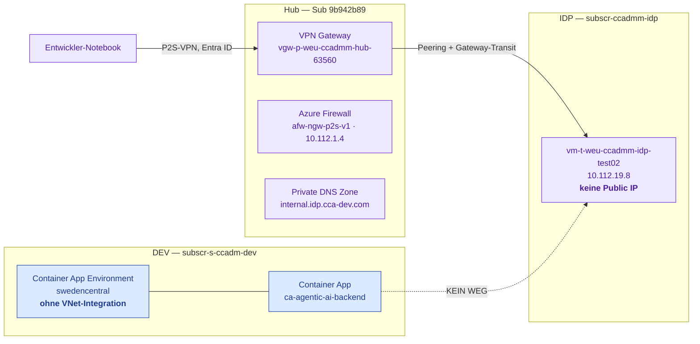
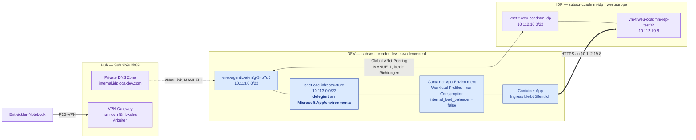
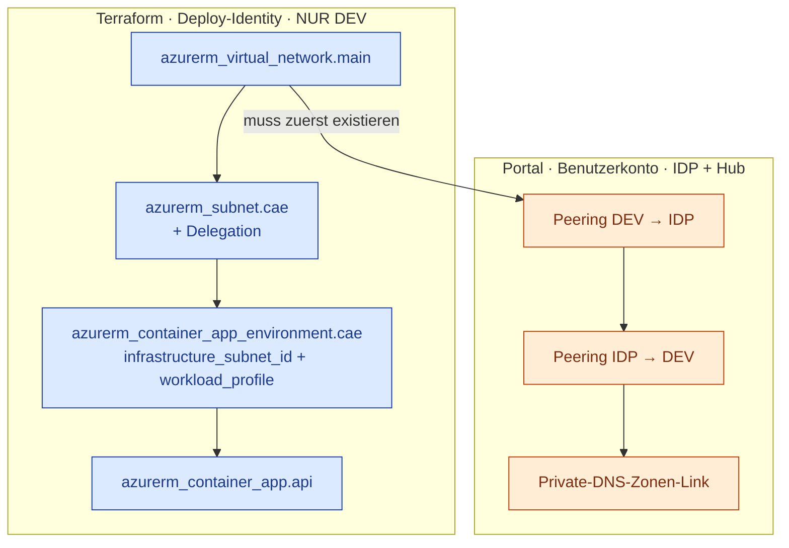

# Netzwerkarchitektur — Anbindung der Container App an Smart Planning

> **Dokumenttyp:** zitierfähige Infrastruktur- und Netzwerkdokumentation
> **Stand:** 04.08.2026
> **Geltungsbereich:** Netzwerkpfad zwischen der Azure Container App (DEV) und der
> Smart-Planning-Instanz (ESAROM) auf `vm-t-weu-ccadmm-idp-test02`.
> **Abgrenzung:** Anwendungsarchitektur siehe [ARCHITEKTURDIAGRAMME_PROJEKTBERICHT.md](ARCHITEKTURDIAGRAMME_PROJEKTBERICHT.md).
> Die Klickanleitung für die manuellen Schritte steht im Infrastruktur-Repository
> unter `docs/NETWORK_SETUP.md`.

---

## 1. Leselogik — bitte zuerst lesen

| Kennzeichnung | Bedeutung |
|---|---|
| **IST** | Heute in Azure vorhanden und per Abfrage nachgewiesen (Abschnitt 9). |
| **SOLL** | Als Terraform-Code geschrieben, aber noch nicht vollständig ausgerollt. |

> **Stand 08.08.2026 — die Infrastrukturkette steht vollständig.**
> VNet, delegiertes Subnetz, Workload-Profiles-Environment und Container App sind
> ausgerollt; beide Peering-Richtungen stehen auf `Connected`, der DNS-Zonen-Link
> auf `Completed`. Die Container App ist `Healthy` und antwortet.
> **Noch offen ist allein der fachliche Nachweis:** ein echter ESAROM-Aufruf aus
> der Container App (Snapshot-Validierung). Bis dahin ist belegt, dass der Pfad
> *gebaut* ist — nicht, dass er *trägt*.

Farbkonvention (kompatibel zur bestehenden Architekturdokumentation):

- **Blau:** eigenes System / eigene Terraform-Ressourcen
- **Violett:** fremde Infrastruktur außerhalb der eigenen Subscription
- **Orange:** manuell und bewusst außerhalb der Automatisierung
- **Grau gestrichelt:** noch nicht ausgerollt

---

## 2. Das Problem in einem Satz

Die Smart-Planning-VM hat **keine öffentliche IP**, liegt in einer fremden
Subscription und trägt einen **privaten DNS-Namen** — die Container App lief
dagegen ohne VNet-Anbindung und kannte nur das öffentliche Internet.

Es sind daher **zwei** Probleme, nicht eines:

1. **Routing** — es existiert kein Netzwerkpfad in ein privates Netz.
2. **Namensauflösung** — `*.internal.idp.cca-dev.com` ist eine private DNS-Zone.

Eine Lösung, die nur eines von beiden adressiert, führt zu einem der beiden
typischen Fehlerbilder: Namensauflösung schlägt fehl (DNS fehlt) oder die
Verbindung läuft in einen Timeout (Routing fehlt).

---

## 3. Beteiligte Subscriptions

| Rolle | Name | ID | Rechtelage |
|---|---|---|---|
| DEV — eigene Anwendung | `subscr-s-ccadm-dev` | `17b4807c-05a1-4c15-b35e-1a6b20bc37b3` | Terraform / Deploy-Identity |
| IDP — Smart-Planning-VM | `subscr-ccadmm-idp` | `40e08bde-e349-4ac5-8299-6c6e2f5c33f6` | Benutzerkonto, volle Rechte |
| Hub — Netz und DNS | *(Connectivity)* | `9b942b89-e1d1-454e-a11c-18531063ef2d` | Benutzerkonto, volle Rechte |

**Grundsatz für die DEV-Umgebung:** Es wird ausschließlich verwendet, was das eigene
Terraform mitbringt. Bestehende Ressourcen in DEV — insbesondere das vorhandene
`vnet-dev-soi` samt dessen Hub-Peering — werden **nicht** genutzt.

---

## 4. IST — Zustand vor der Umstellung



**Warum der lokale Zugriff funktioniert, der aus der Cloud aber nicht:** Das
Notebook meldet sich per Point-to-Site am Hub-Gateway an. Das IDP-Spoke hat
`useRemoteGateways = true` und bekommt die Gateway-Routen propagiert — der
VPN-Client erreicht die VM also über den Hub. Die Container App ist an diesem
Netz überhaupt nicht beteiligt.

---

## 5. SOLL — Zustand nach vollständigem Rollout



**Der Hub ist am Datenpfad nicht mehr beteiligt.** Das Peering geht direkt von
Spoke zu Spoke. Der Hub bedient nur noch das lokale VPN und hält die DNS-Zone.

---

## 6. Adressplan

| Netz | Bereich | Region | Herkunft |
|---|---|---|---|
| `vnet-p-weu-ccadmm-hub` | `10.112.0.0/23` | westeurope | IST |
| `vnet-t-weu-ccadmm-idp` | `10.112.16.0/22` | westeurope | IST |
| *(winvm-demo)* | `10.112.32.0/29` | — | IST |
| `vnet-dev-soi` | `10.100.200.0/22` | — | IST, **nicht genutzt** |
| *(LLM-Spokes)* | `10.127.224.0/22`, `10.127.228.0/24` | — | IST |
| *(Workstation-Spokes)* | `10.128.0.0/22` … `10.128.12.0/22` | — | IST |
| **`vnet-agentic-ai-mfg-34b7u5`** | **`10.113.0.0/22`** | swedencentral | **IST seit 04.08.2026** |
| ↳ `snet-cae-infrastructure` | `10.113.0.0/23` | swedencentral | IST, delegiert |

`10.113.0.0/22` ist gegen alle am Hub sichtbaren Peerings kollisionsfrei.

> **Einschränkung dieser Prüfung:** Sichtbar sind nur die an
> `vnet-p-weu-ccadmm-hub` gepeerten Bereiche. Eine IPAM-Bestätigung steht aus.
> Fehlerart im Kollisionsfall: die Peering-Erstellung schlägt **sichtbar** fehl,
> Azure lehnt überlappende Adressräume ab. Kein stiller Ausfall.

**Subnetzgröße /23:** Workload-Profiles-Environments verlangen mindestens /27.
Der großzügigere Zuschnitt kostet nichts und hat sich ausgezahlt — als die
Delegation nachgetragen werden musste (R4), war **kein Neuzuschnitt** nötig.

---

## 7. Verantwortungsteilung — automatisiert gegen manuell



### Warum drei Schritte bewusst manuell bleiben

Azure verlangt zum Anlegen eines Peerings die Berechtigung
`Microsoft.Network/virtualNetworks/peer/action` auf dem **Ziel**-VNet. Auch die
DEV-seitige Hälfte bräuchte damit eine Rolle in der IDP-Subscription.

**Entscheidung (04.08.2026):** Die Deploy-Identity erhält **keine einzige
Berechtigung außerhalb von DEV**. Peering und DNS-Link werden manuell mit dem
Benutzerkonto angelegt. Eine CI-Identity mit Schreibrecht in einer fremden
Subscription ist ein Angriffsziel, das der Nutzen nicht rechtfertigt.

**Zur Laufzeit berührt die Managed Identity die IDP-Subscription ohnehin nie:**
ACR, Key Vault und Azure OpenAI liegen in DEV; die Anmeldung an ESAROM läuft über
Keycloak mit `SMART_PLANNING_CLIENT_SECRET`, nicht über Entra ID.

---

## 8. Architekturentscheidungen

### E1 — Direktes Spoke-zu-Spoke-Peering statt Route über die Hub-Firewall

**Gewählt:** Direktes Peering `vnet-agentic-ai-mfg-34b7u5` ↔ `vnet-t-weu-ccadmm-idp`.

**Begründung:** Keine UDR, keine Firewall-Regel, kein Gateway. Die
Produktions-Firewall `afw-ngw-p2s-v1` wird nicht angefasst.

**Preis:** Der Verkehr umgeht die Hub-Firewall und damit deren zentrale
Protokollierung und Filterung. Für eine DEV-Anbindung an eine Testinstanz
vertretbar — für einen Produktivpfad wäre die Route über die Firewall richtig.

### E2 — VNet in swedencentral, nicht in westeurope

Das Infrastruktur-Subnetz muss in derselben Region wie die Environment liegen,
und die gesamte übrige Infrastruktur (ACR, Key Vault, SQL, Azure OpenAI) steht in
swedencentral. **Folge:** Das Peering ist ein **Global VNet Peering** — höherer
Preis je GB, rund 20 ms zusätzliche Latenz. Bei mehrminütigen Pipeline-Läufen
bedeutungslos.

### E3 — Ingress bleibt öffentlich

`internal_load_balancer_enabled = false`. Die VNet-Integration führt ausschließlich
den **ausgehenden** Verkehr durch das eigene Subnetz. Der eingehende Ingress muss
öffentlich bleiben, sonst ist die Weboberfläche nicht mehr erreichbar.

### E4 — Workload Profiles mit ausschließlich dem Consumption-Profil

Erzwungen durch R4. Die Environment ist formal eine Workload-Profiles-Environment,
enthält aber **kein Dedicated-Profil**. Die Abrechnung bleibt damit
verbrauchsbasiert.

> **Wer hier ein zweites Profil ergänzt, ändert das Kostenmodell.** Ein
> Dedicated-Profil wird rund um die Uhr pro Instanz berechnet, unabhängig von der
> Auslastung.

### E5 — Kein Zwischensystem

Verworfen: eigenes VPN Gateway in DEV (laufende Kosten ohne Mehrwert), Private
Link Service (Aufwand auf der IDP-Seite ohne Sicherheitsgewinn hier) und Azure
Relay. **Azure Relay bleibt der dokumentierte Rückfallweg**, falls das Peering
organisatorisch je zurückgenommen wird.

---

## 9. Nachweise

Alle Angaben stammen aus Leseabfragen gegen Azure vom 04.08.2026.

| Aussage | Nachweis |
|---|---|
| VM ohne öffentliche IP, `10.112.19.8` | `az network nic show` → `publicIp: null` |
| VM liegt im Spoke, nicht im Hub | Subnetz `snet-t-weu-ccadmm-idp-privateendpoints` in `vnet-t-weu-ccadmm-idp` |
| Spoke nutzt Hub-Gateway | Peering `useRemoteGateways: true`, Status `Connected` |
| DNS-Zone ist Azure Private DNS Zone | `az network private-dns zone list` in `rg-p-weu-ccadmm-hub-dns` |
| Zone enthält den Zielnamen | A-Record `vm-t-weu-ccadmm-idp-test02` → `10.112.19.8` |
| CAE hatte keine VNet-Integration | `main.tf` ohne `infrastructure_subnet_id`; 0 `azurerm_virtual_network` im Repo |
| Belegte Adressbereiche | `az network vnet peering list` am Hub, 9 Peerings |
| VNet real angelegt | `az network vnet list` → `vnet-agentic-ai-mfg-34b7u5`, `10.113.0.0/22` |

### Planläufe

**Erster Plan (vor dem Apply):** `4 to add, 3 to change, 2 to destroy` — ersetzt
wurden ausschließlich `container_app_environment.cae` und `container_app.api`.
SQL, Key Vault, ACR, Storage und Static Web App standen **nicht** in der
Ersetzungsliste.

**Apply gescheitert** an der fehlenden Subnetz-Delegation (R4).

**Plan nach der Korrektur:** `2 to add, 4 to change, **0 to destroy**` — reine
Reparatur. Das Subnetz erhält die Delegation **in-place**, das VNet bleibt
unberührt, Environment und Container App werden neu erstellt.

---

## 10. Bekannte Grenzen und Risiken

### R1 — Peering und DNS-Link liegen nicht im Terraform-State

Wird das VNet je ersetzt, verschwinden beide **ohne Meldung**. Terraform berichtet
Erfolg, und die Container App verliert wortlos die Verbindung zu Smart Planning.
Bewusst akzeptierter Preis der Rechtetrennung aus Abschnitt 7.
**Nach jedem Ersetzen des VNets sind die drei manuellen Schritte zu wiederholen.**

### R2 — Der Rollout ersetzt laufende Ressourcen

Terraform arbeitet destroy-then-create. Environment und Container App werden
gelöscht, bevor die neuen entstehen: **Ausfallzeit und eine neue Backend-FQDN**.
Danach muss `deploy-frontend.yml` laufen, damit `BACKEND_URL_PLACEHOLDER` in
`app/ui/scripts/config.js` auf die neue URL zeigt.

### R3 — Adressraum nur teilweise verifizierbar

Siehe Abschnitt 6. IPAM-Bestätigung steht aus; Kollisionen fallen bei der
Peering-Erstellung sichtbar auf.

### R4 — Subnetz-Delegation *(EINGETRETEN und GELÖST, 04.08.2026)*

Der erste `apply` scheiterte an:

```
ManagedEnvironmentSubnetDelegationError: The subnet of the environment
must be delegated to the service 'Microsoft.App/environments'.
```

Azure lässt eine VNet-integrierte Environment **nicht** ohne Subnetz-Delegation
zu, und ein delegiertes Subnetz bedingt eine Workload-Profiles-Environment. Die
ursprüngliche Annahme, Consumption-only komme hier ohne Delegation aus, war für
diesen Weg falsch. Lösung siehe E4.

**Betriebliche Folge:** Environment und Container App waren zum Zeitpunkt des
Fehlers bereits gelöscht — **das Backend war bis zum korrigierten Apply offline**.
Wer diesen Umbau wiederholt, plant ein Wartungsfenster ein.

### R5 — Nebenläufigkeit bleibt ungelöst

Unabhängig vom Netz: `max_replicas = 1` bei mehrminütigen Pipeline-Läufen
bedeutet, dass ein Lauf die einzige Instanz vollständig belegt.

### R6 — TLS-Prüfung gegen ESAROM ist abgeschaltet

13 Stellen im Anwendungscode rufen ESAROM mit `verify=False` auf. Der neue
Netzwerkpfad ändert daran nichts.

---

## 11. Kostenwirkung

| Position | Kosten |
|---|---|
| VNet, Subnetz | 0 € |
| Peering-Verbindung als solche | 0 € |
| Peering-Datenverkehr (global) | je GB, beide Richtungen |
| Private-DNS-Zonen-Link | 0 € |
| VPN Gateway, Azure Firewall, NAT Gateway | entfallen vollständig |
| Workload-Profiles-Environment, nur Consumption | verbrauchsbasiert wie zuvor |

Snapshots liegen bei rund 5,7 MB. Selbst tausend Übertragungen im Monat ergeben
etwa 6 GB und damit einen Betrag im Centbereich.

**Die dominierende Kostenposition bleibt unverändert:** `min_replicas = 1` mit
0,5 vCPU und 1 GiB rund um die Uhr — eine Entscheidung vom 02.08.2026 gegen den
Kaltstart, vom Netzumbau nicht berührt.

Konkrete Eurobeträge werden bewusst nicht genannt: Container-Apps-Preise
unterscheiden sich nach Region sowie zwischen Idle- und Active-Tarif.

---

## 12. Offene Punkte

| # | Punkt | Status |
|---|---|---|
| 1 | Korrigierten `apply` ausführen | ✅ **erledigt 08.08.2026** |
| 2 | Peering DEV → IDP (`peer-agenticai-to-idp`) | ✅ `Connected` |
| 3 | Gegenrichtung (`peer-idp-to-agenticai`) | ✅ `Connected` |
| 4 | Private-DNS-Zonen-Link (`link-agentic-ai-mfg`) | ✅ `Completed` |
| 5 | `deploy-frontend.yml` nachziehen (neue FQDN) | ✅ erledigt |
| 6 | **Fachlicher Nachweis: Snapshot-Validierung aus der Container App** | **offen** |
| 7 | `10.113.0.0/22` gegen das IPAM bestätigen | offen, nicht blockierend |

### Abnahmestand 08.08.2026

| Prüfung | Ergebnis |
|---|---|
| Container App Revision | `--0000002`, **Healthy**, 1 Replica |
| Laufendes Image | `agentic-ai-backend:0.3.1` |
| Ingress erreichbar | `GET /` → 200 |
| Datenbankverbindung | `GET /api/dashboard/metrics` → 200 |
| Peering beide Richtungen | `Connected` / `Connected` |
| Hub-Peering des IDP-Spokes | unverändert `Connected` |
| DNS-Zonen-Link | `Completed`, bestehender Hub-Link unberührt |

**Was damit NICHT bewiesen ist:** dass ein HTTPS-Aufruf aus dem Container die VM
unter `10.112.19.8` tatsächlich erreicht. Peering und DNS sind konfiguriert —
ob die Kette trägt, zeigt erst eine echte Snapshot-Validierung (Punkt 6).
